# Projeto Alien Nest Cleaners

# Descrição Resumida do Projeto/Jogo

Projeto da disciplina de orientação a objetos, primeiro semestre de 2022.
Nesse jogo três robos controlados remotamente são encarregados de eliminar os ovos de um alien invasor para que este saia da nave.
Além disso, é necessário controlar a quantidade de fungos que vem crescendo na nave e, principalmente, manter os robôs a salvo do alien que espreita na escuridão.

# Equipe
* `Luc Joffily Ribas` - `247231` 
* `Rafael Gregori de Souza` - `247346`

# Arquivo Executável do Jogo

> [Link para o executável](assets/readmeAssets/ANC.jar)

# Slides do Projeto

## Slides da Prévia
>[Link](https://drive.google.com/file/d/1b1BZOB1QTkyP8iMLsTfIILZwD4t5lt8q/view?usp=sharing)

## Slides da Apresentação Final
> [Link](https://docs.google.com/presentation/d/1xyjWFhrCbyZV30Mo_N_7FFh13gUgEdvw8kLYVz-yiSo/edit?usp=sharing)

# Relatório de Evolução
No decorrer da realização do jogo tivemos diversos problemas com relação a diversos aspectos. O processo de implementação do RayCasting, por exemplo, foi um grande desafio
em decorrência da complexidade do algorítmo e da necessidade de aprendizado não apenas da biblioteca gráfica, mas também da API (OpenGL) a partir da qual esta é 
implementada. Além disso, aconteceram diversos erros relacionados com as convenções adotadas para as coordenadas,
houve uma certa dificuldade em coordenar as coordenadas da matriz para que tanto o RayCaster quanto o AStar pudessem funcionar corretamente.
Aprender e compreender como a linguagem Kotlin e o LibKTX (LibGDX para o Kotlin) podem ser diferenciais no código também foi um tema presenta no decorrer do projeto.

O projeto, inicialmente, nos parecia bem definido com uma arquitetura relativamente simples que tínhamos em mente (vide slides da prévia).
Entretanto, conforme o avanço do projeto, percebemos a necessidade de expandir a arquitetura com
diversas interfaces (visando o polimorfismo e o encapsulamento) e design patterns (adapter e strategy)
que foram essenciais para formar um software organizado, consistente com o paradigma da orientação a objetos e facilmente expansível.
Isso pode ser observado comparando os diagramas inicial (presente nos slides da prévia) e final, em que se observa a presença de diversas interfaces que comunicam entre si e entre os componentes.
Não apenas na arquitetura, houve mudanças também quanto nas mecânicas e ideias do jogo, por exemplo: inicialmente, pensávamos que todos os personagens (os robôs)
seriam todos iguais e dependeriam de itens para realizar ações como quebrar teias e ovos. Porém, visando a prática da orientação à objetos, 
decidimos programar 3 classes diferentes (Recon, Botanist e Pyro) que herdam Player, uma classe abstrata.

Por fim, vale constar o esforço despendido em como generalizar as mecânicas do jogo. Conforme o projeto avançava, foram feitas adaptações conforme a arquitetura era estruturada,
como por exemplo: o movimento, no qual foi decidido programar o algoritmo de grafo A*, que pode ser utilizado para mapas de grandes proporções;
dispersão dos fungos e a probabilidade de tal ocorrer, programamos a chance de 10% de dispersão para cada um dos tiles adjacentes que sejam paredes,
mas tivemos que ficar bem atentos ao fato de que há a possibilidade de dispersar para uma parede inatingível pelo jogador, a qual,
portanto, não é contabilizada pela variável contadora de fungos, entre outras. 
Assim, acreditamos que o resultado final do projeto é facilmente escalável sem perdas de eficiência ou causar bugs.

# Destaques de Código

## A Star
> Este é o algoritmo de busca em grafo A*, utilizado no movimento do Alien e dos jogadores. Essencialmente, este algoritmo realiza um chute pensado de melhor caminho utilizando uma heurística (nesse caso, foi utilizada a Manhattan, a mais adequada para um grid em que os movimentos são cima, baixo, esquerda e direita, ou seja, sem movimentos diagonais), sendo que esse valor será combinado com a distância do nó inicial e teremos, portanto, o valor F que servirá de parâmetro para analisar o próximo nó. Caso haja maior interesse em entender o algoritmo, recomendamos o seguinte vídeo:
>   
[Vídeo](https://www.youtube.com/watch?v=-L-WgKMFuhE&t=181s)
### Código
~~~kotlin
private fun findPathAstar(source: IVector2, dest: IVector2, acceptBlockedDest: Boolean): List<IVector2>?{
        // ver se a posicao destino eh valida
        if (dest.isOutOfRange() || source.isOutOfRange() || (!acceptBlockedDest && dest.isBlocked())) return null
    
        
        //checar caminho enquanto a mutable list open nao esta vazio e nao chegamos no tile final
        //caso encontrarmos o tile final (node == end) , devolvemos um mutable list com os tiles a serem caminhados
        while (open.isNotEmpty()){
            val node = open.nextNode()
            if (node == end) {
                return resultPath(node)
                //caso encontrarmos o tile final, devolvemos um mutableList com os tiles a serem caminhados
            }

            open.remove(node)
            node.wasVisited = true
            
            //para cada um dos vizinhos, calcularemos o valor f = heuristica + distancia_no_inicial e
            // vamos seguir a busca para o no de menor valor f
            node.forEachNeighbor { neighbor ->
                // se eh parede ou vizinho possuir componente bloqueador, return
                if (!foundEnd) foundEnd = neighbor == end && acceptBlockedDest
                if ((neighbor != end && neighbor.notTraversable) || neighbor.wasVisited || foundEnd) return@forEachNeighbor
                
                if (neighbor.parent == null || neighbor.parent?.let {it.g > node.g} == true){
                    neighbor.parent = node
                    neighbor.g = node.g + 1
                    open.add(neighbor)
                    changed.add(node)
                }
                
            }
            if (foundEnd) return resultPath(node)
        }
        //se nao houve return, é impossível chegar no tile clicado, logo retornamos um mutable list nulo
        return null
    }
~~~

## Ray Casting
> O algoritmo do Ray Casting foi realizado seguindo o seguinte tutorial: [link](https://lodev.org/cgtutor/raycasting.html). De maneira simplificada, 
> este algoritmo consiste em criar diversos raios ao longo de um campo de visão andando de tile em tile dentro de uma grid
> até que o raio encontre uma parede. Quando isso acontece é calculada a distância percorrida perpendiculamente ao plano de visão,
> de maneira que a altura da mesh mostrada na tela é inversamente proporcional a essa distância.
  
### Código
~~~kotlin
class RayCaster(
    private val tiles: List<List<RayCastTile>>
    ...
): DrawableRayCaster {
    ...

    fun multipleRayCast3D(player: Player) {
        ...
        // para todos os pixels na largura da tela
        for (x in 0 until WIDTH.toInt()) {
            val cameraX = 2 * x.toFloat() / WIDTH - 1
            // calcula a direção do raio atual
            rayDir = Vector2(
                player.dir.x + player.cameraPlane.x * cameraX,
                player.dir.y + player.cameraPlane.y * cameraX
            )
            ...
            // armazena o resultado de um rayCast
            val result = singleRayCast(player, rayDir)
            ...
            // calcula altura da linha
            val h = 1.5f * HEIGHT
            val lineHeight = tileHeight * (h / perpDist)
            
            // calcular inicio e fim do faixa encontrada pelo raio
            drawStart = -lineHeight / 2 + h / 2
            floorLevel = max(drawStart, floorLevel)
            drawEnd = lineHeight / 2 + h / 2
            ...

            if (prevTile == null || prevTile != tile || prevSide != side) {
                // cria as meshes
                ...
            }
                
        }
        if (prevTile != null) {
            // cria a ultima mesh
            ...
        }
    }
    ...
    private fun singleRayCast(player: Player, rayDir: Vector2): Triple<RayCastTile, Int, Float> {
        ...
        // vai andando com o raio até encontrar uma parede
        while (!tiles[mapPos.i][mapPos.j].isWall) {
            // realiza o raycast
            if (rayLengths.x < rayLengths.y) {
                mapPos.i += step.i
                side = 0
                rayLengths.x += rayStepSize.x
            } else {
                mapPos.j += step.j
                side = 1
                rayLengths.y += rayStepSize.y
            }

        }
        ...

    }
}
~~~

## Criação da Mesh do Ray Cast Component
> O algoritmo para criação da mesh dos Ray Cast Components foi realizado seguindo o seguinte tutorial: [link](https://lodev.org/cgtutor/raycasting3.html).
> Para criação das meshes é aplicada uma transformação linear no vetor entre o jogador selecionado e o componente de maneira que é possível
> obter a distância perpendicular do componente em relação ao plano de visão do jogador, com isso é possível calcular a largura e altura do componente e 
> utilizar essa informação para criar a mesh

### Código
~~~kotlin
open fun update(player: Player, zBuffer: List<Float>, tileWidth: Float, tileHeight: Float){
    
    // posição relativa do jogador com o componente (utilizando uma matriz de mudança de coordenadas)
    val transformedPos = Vector2(x - player.x, y - player.y)
    val invDet = 1f / (player.cameraPlane.x * player.dir.y - player.dir.x * player.cameraPlane.y)
    transformedPos.set(
        invDet * (player.dir.y * transformedPos.x - player.dir.x * transformedPos.y),
        invDet * (-player.cameraPlane.y * transformedPos.x + player.cameraPlane.x * transformedPos.y)
    )
    if (transformedPos.y == 0f) return

    val h = 1.5f*HEIGHT
    val spriteScreenX = (WIDTH / 2) * (1 + transformedPos.x / transformedPos.y)
    val spriteHeight = tileHeight * h / transformedPos.y // transformedPos.y é a distancia perpendicular
    val drawStartY =  -spriteHeight / 2 + h / 2

    val spriteWidth = tileWidth * h / transformedPos.y
    var drawStartX = -spriteWidth / 2 + spriteScreenX
    var drawEndX = spriteWidth / 2 + spriteScreenX

    // verifica se o componente está totalmente fora da tela
    if(drawStartX >= WIDTH || drawEndX < 0 || transformedPos.y < 0) {
        seen = false
        return
    }

    // procura o valor inicial do componente em X que não está atras de algo
    ...

    // procura o valor final do componente em X que não está atras de algo
    ...
    
    // cria a mesh para ser desenhada
    ...
    seen = true
}
~~~

# Destaques de Orientação a Objetos

## Sistema de telas:
> Inicialmente, no topo do diagrama, temos a classe abstrata CustomScreen que herda a Screen nativa do LibKTX. Em seguida, temos GameScreen e MenuScreen que são telas dinâmicas (ou seja, com ações), e, no mesmo nível, uma classe abstrata ImageScreen que será herdada por LoseScreen, InstructionScreen e WinScreen, telas que são apenas imagens estáticas.

### Diagrama
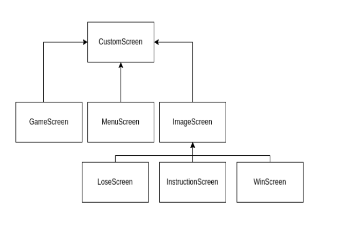

### Código
~~~kotlin
abstract class CustomScreen(
        val game: MyGame,
        val batch: Batch = game.batch,
        val renderer: ShapeRenderer = game.renderer,
        val font: BitmapFont = game.font,
        val viewport: FitViewport = game.gameViewport,
) : KtxScreen {
    override fun resize(width: Int, height: Int) {
        viewport.update(width, height)
    }
    ...
}
~~~

## Polimorfismo e Encapsulamento:
> Visando o encapsulamento, vemos na função abaixo que a propriedade tiles utiliza uma matriz de DrawableTile, uma interface 
> que possui apenas as funções draw e drawOutline que são necessárias para desenhar o Grid. Note que a classe Tile implementa
> DrawableTile, de maneira que podemos iterar sobre a matriz de DrawableTile em vez de Tile, aplicando assim o polimorfismo.

### Código
~~~kotlin
private fun drawTileMap(
    ...,
    tiles: List<List<DrawableTile>>,
    ...
    ){
        ...
        renderer.use(ShapeRenderer.ShapeType.Filled, camera.combined){
            ...
            tiles.forEach{ line ->
                line.forEach { tile ->
                    tile.draw(mirroredX, mapRect.y, ratio, renderer)
                }
            }

        }
        ...
        renderer.use(ShapeRenderer.ShapeType.Line, camera.combined){
            tiles.forEach{ line ->
                line.forEach { tile ->
                    tile.drawOutline(mirroredX, mapRect.y, ratio, renderer)
                }
            }
        }
    }
~~~

## Classe abstrata RayCastComponent:
> Todos os RayCastComponents, ou seja, componentes do jogo que serão renderizados em 3D, 
> mas não são paredes, como ovo, jogador e alien, tem certos atributos, como a textura para o 3D
> e a textura para o mapa, e funções, como de renderizar no 3D ou desenhar no mapa

### Diagrama
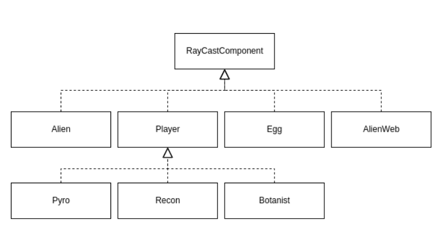

### Código
~~~kotlin
abstract class RayCastComponent(
    tile: RayCastTile,
    ...
    override val texture: Texture,
    val mapTexture: Texture,
):
    Disposable,
    Comparable<RayCastComponent>,
    Component,
    MapBatchDrawable
{
    ...
}
~~~

## Expansibilidade:
> A classe Player é uma classe abstrata que tem todas os atributos e funções para a manipulação e desenho dos jogadores.
> Para criar um novo jogador é muito simples, além de fazer a arte é necessário apenas criar uma nova classe de jogador,
> especificar parâmetros como nome, energia máxima e tamanho da camera de visão e atribuir para o novo jodaor um número 
> no construtor da ship. Para modificar um jogador também é fácil, bastando apenas alterar os atributos na classe.

### Código
~~~kotlin
class NovoJogador(...params) : Player(params) {
    override val name: String
        get() = "Novo Jogador"
    override val maxEnergy: Int
        get() = 10 
    override val webEnergy: Int
        get() = 2
    override val fungusEnergy: Int
        get() = 4
    override val eggEnergy: Int
        get() = 4
    override val cameraPlaneSize: Float
        get() = 0.40f

}
~~~

# Destaques de Pattern

## Adapter
> Como o Raycaster gera várias meshes para renderização e a renderização de cada uma delas individualmente é mais cara e mais trabalhosa do que em grupo, foi implementado um adaptador de lista de mehes (MeshGroup) para que essas meshes pudessem ser renderizadas de maneira mais compartimentalizada e eficiente

### Diagrama do Pattern
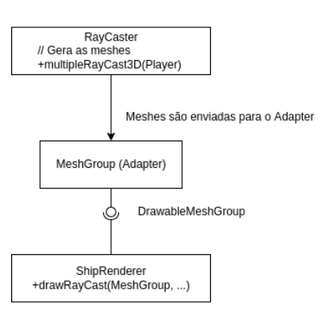

### Código do Pattern
~~~kotlin
class MeshGroup(private val meshes: MutableList<Textured2DMesh>): DrawableMeshGroup {
    ...
    override fun render(...params) {
        shader.bind()
        // manda a matriz da camera para o shader
        ...
        meshes.forEach { mesh ->
            // só troca a textura se a textura anterior for diferente a atual
            if (texture == null || mesh.texture != texture) {
                texture = mesh.texture
                mesh.texture.bind()
            }
            // ajusta as meshes
            mesh.moveAndScale(initialX, initialY, ratio)
            // divide a cor das meshes para ficar mais claro a imagem
            shader.setUniformf("f_colorDiv", mesh.colorDiv)
            mesh.render(shader)
        }
    }
    ...
}
~~~

## Strategy
>  O componente no centro da visão do jogador será responsável por chamar sua própria função "die()" quando o jogador destruí-lo

### Diagrama do Pattern
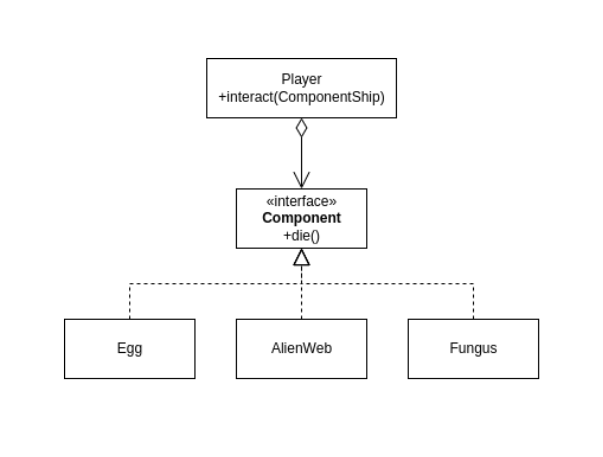

### Código do Pattern
~~~kotlin
class TargetComponent(
    val component: Component,
    val dist: Float
) {
    val type get() = component.type
        ...
    fun die() = component.die()
}
~~~

# Conclusão e Trabalhos Futuros
Com este projeto, percebemos, inicialmente, a importância do pensamento em alto nível antes de começar a programar de fato o jogo, ou seja, o quão necessário é ter organização prévia. Com o fato de que o jogo finalizado distanciou-se do planejamento inicial, observamos que, no desenvolvimento de software,
muitas vezes o pensamento algorítmico e de arquitetura será claro apenas durante o desenvolvimento do produto, pois é durante o processo de criação que novas dificuldades surgem e portanto adaptações são necessárias.

Nesta linha de pensamento, concluímos assim que os princípios de orientação a objetos e os design patterns tornam-se evidentes quando é sentida a necessidade deles no código.
Enfim, é ideal que o uso dos patterns e princípios sejam de uso natural e lógico, e não forçados propositalmente. Por fim, vale dizer que, principalmente em sistemas de alta escala (como de empresas Big Tech),
o conhecimento de arquitetura de software é essencial para o bom funcionamento, eficiência e reaproveitamento de projetos já realizados.

No entanto, sentimos também, que nosso trabalho poderia melhorar em diversos aspectos. Um exemplo é que o mapa do jogo atualmente só pode ser quadrado, de maneira que não há
uma otimização do espaço da tela, portanto uma possível melhoria seria permitir mapas com diferentes dimensões. Além disso, no jogo atual tem-se apenas um mapa, durante o 
período de realização do projeto não conseguimos montar mais mapas, apesar da montagem envolver apenar escrever um arquivo de texto .map, nesse contexto também seria necessário 
criar um sistema de escolha de níveis. Outra feature que não conseguimos implementar a tempo é um montador de mapa dentro do jogo que permita com que os jogadores pudessem montar
os próprios mapas e testa-los. Por fim, percebemos que poderiamos ter adotado alguns design patterns além dos que já foram mencionados. As classes TextureLoader e MapReader,
por exemplo, poderiam ser singletons. 

Apesar disso, foi possível aprender e implementar de maneira eficaz diversos conceitos de programação orientação a objetos, como os patterns mencionados anteriormente,
interfaces para auxiliar na coerência do código e encapsular funções, polimorfismo para que apenas as informações necessárias dos objetos esteja aparente e um plano de exceções.
Além disso, os algoritmos implementados para utilização no jogo, como o A* e o RayCast e como relacioná-los a um projeto maior foram conhecimentos importante para nossa formação como programadores.

Outros trabalhos futuros, poderiam ser: a adição de mais jogadores humanos para o jogo, ou seja, que mais pessoas joguem simultaneamente e que cada uma delas possua seus próprios robôs
que não podem ser controladas por outras; a adição de aliens de diferentes tipos, sendo que eles podem possuir habilidades diferentes de colocar ovos (como foi feito no jogo atual); adicionar novos componentes, sejam eles
vantajosos para os jogadores ou não, como, por exemplo, um ácido em certos tiles que aumente a energia despendida para andar sobre eles. 

# Documentação de Compoenentes

## Diagrama Geral da Arquitetura do Jogo

> Primeiramente o GameBuilder irá montar uma Ship, que conterá todas as informações referentes aos tiles, componentes e players. Essas informações serão comunicadas para o view através de interfaces "Drawable"
> para que este apresente-as ao usuário. O input processor é responsável por receber os comandos do jogador e enviar para o selected player que realizará as ações correspondentes. Além disso há um Ray Caster
> que é responsável por criar a visão 3D e enviar as meshes geradas para o view.

## Diagrama de componentes
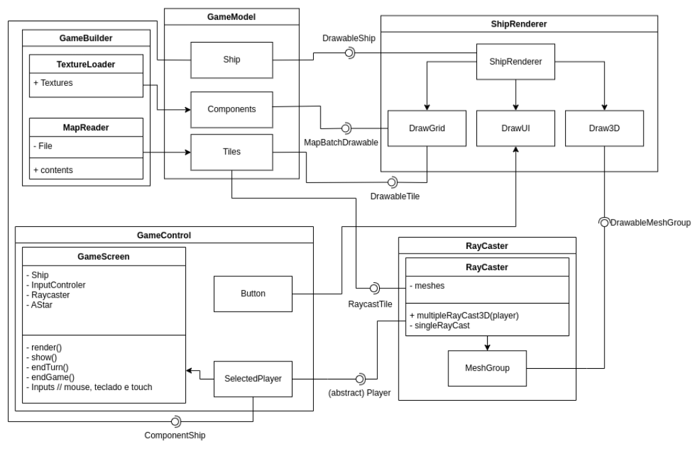

## Componente `Game Builder`
Game Builder é basicamente onde o jogo será inicializado. Conta com a presença de um
carregador de texturas e um leitor de arquivos para gerar o grid.

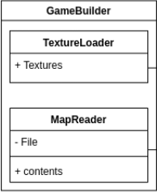

**Ficha Técnica**

item | detalhamento
----- | -----
Pacote | `trabalhofinal.utils`
Autores | `Luc e Rafael`
Interfaces |

## Componente `Game Model`
Game Model concentra comunica para os outros componentes informações necessárias do grid e dos compoenentes para o andamento do jogo, como a presença de um
componente em certo tile.

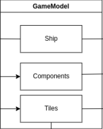

**Ficha Técnica**

item | detalhamento
----- | -----
Pacote | `trabalhofinal.components`
Autores | `Luc e Rafael`
Interfaces | `Component`   `ComponentShip`

### Detalhamento das Interfaces

#### Interface `Component`

Interface que permite acesso ao método buildGame para montagem do jogo.

~~~kotlin
interface Component {
    val isWall: Boolean
    val texture: Texture?
    var color: Color
    val type: ComponentType

    fun die() {}
}
~~~

Método | Objetivo
-------| --------
`die` | Elimina um componente de um tile.
`isWall` | Retorna se o componente é uma parede ou não.
`texture` | Retorna a textura de um componente.
`color` | Retorna ou seta a cor associada de um componente.
`type` | Retorna o tipo (presentes no Enum ComponentType) do componente.

## Componente `ShipRenderer`

Componente responsável pelas renderizações tanto de interface gráfica 2D quanto 3D (relacionada ao RayCast)

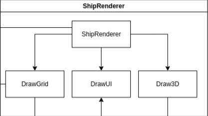

**Ficha Técnica**

item | detalhamento
----- | -----
Pacote | `trabalhofinal.components`
Autores | `Luc e Rafael`
Interfaces | `DrawableMeshGroup`  `DrawableRayCaster`   `DrawableShip`   `DrawableTile`   `MapBatchDrawable`   `MapShapeDrawable` 

### Detalhamento das Interfaces

#### Interface `MapShapeDrawable`

Interface que representa um elemento que pode ser desenhado no mapa utilizando o ShapeRenderer

~~~kotlin
interface MapShapeDrawable {
    fun draw(startX: Float, startY: Float, ratio: Float, renderer: ShapeRenderer)
}
~~~

Método | Objetivo
-------| --------
`draw` | Desenha o elemento na tela utilizando o ShapeRenderer.

#### Interface `MapBatchDrawable`

Interface que representa um elemento que pode ser desenhado no mapa utilizando um Batch (com uma textura)

~~~kotlin
interface MapBatchDrawable {
    fun draw(startX: Float, startY: Float, ratio: Float, batch: Batch)
}
~~~

Método | Objetivo
-------| --------
`draw` | Desenha o elemento na tela utilizando o Batch.

#### Interface `DrawableTile`

Interface que implementa MapShapeDrawable, de maneira a representar um tile que tem tanto seu retângulo quanto sua borda desenhados pelo ShapeRenderer

~~~kotlin
interface DrawableTile: MapShapeDrawable {
    fun drawOutline(startX: Float, startY: Float, ratio: Float, renderer: ShapeRenderer)
}
~~~

Método | Objetivo
-------| --------
`drawOutline` | Desenha a borda do tile utilizando o ShapeRenderer.

#### Interface `DrawableMeshGroup`

Interface que representa um MeshGroup que pode ter suas meshes desenhadas utilizando um shader provido.

~~~kotlin
interface DrawableMeshGroup: Disposable {
    fun render(camera: Camera, shader: ShaderProgram, initialX: Float = 0f, initialY: Float = 0f, ratio: Float = 1f)
}
~~~

Método | Objetivo
-------| --------
`render` | Desenha todos os itens de um MeshGroup em 3D utilizando um shader.

#### Interface `DrawableShip`

Interface que representa a Ship a partir do polimorfismo em drawableTiles e possui atributos relevantes para o fim do jogo

~~~kotlin
interface DrawableShip {
    val drawableTiles: List<List<DrawableTile>>
    val components: MapBatchDrawable
    var numFungi: Int
    val maxFungi: Int
    val numEggs: Int

    fun renderComponents(shader: ShaderProgram, initialX: Float = 0f, initialY: Float = 0f, ratio: Float = 1f)

}
~~~

#### Interface `DrawableRayCaster`

Interface que contém as informações necessárias para desenhar os objeto provenientes do RayCaster

~~~kotlin
interface DrawableRayCaster {
    val collisionPoints: List<Vector2>
    val meshes: DrawableMeshGroup
    val floorLevel: Float
}
~~~

Método | Objetivo
-------| --------
`collisionPoints` | Retorna uma lista com os pontos em que os raios do Ray Cast colidiram.
`meshes` | Retorna um MeshGroup com as meshes geradas pelo RayCaster.
`floorLevel` | Retorna o valor do maior ponto mais baixo entre as meches para o desenho do chão.

## Componente `Game Control`
Componente responsável pelo controle do jogo, em que as ações recebidas seja por teclado e mouse (PC) quanto por toque (Android)
são comunicadas para o jogador atual (Selected Player)

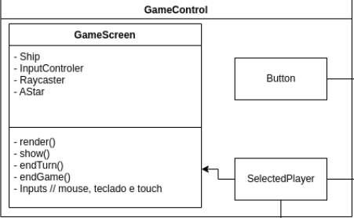

**Ficha Técnica**

item | detalhamento
----- | -----
Pacote | `trabalhofinal.screens`
Autores | `Luc e Rafael`
Interfaces |

## Componente `RayCaster`
Componente responsável por prover informações para a renderização 3D, sendo que as informações dos tiles a serem processadas são recebidas da Ship através da interface RayCastTile.

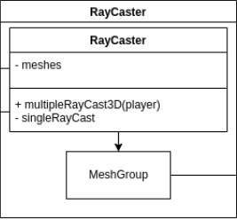

**Ficha Técnica**

item | detalhamento
----- | -----
Pacote | `trabalhofinal.utils`
Autores | `Luc e Rafael`
Interfaces | `RayCastTile`

### Detalhamento das Interfaces

#### Interface `RayCastTile`

Interface que representa um Tile apenas com as informações necessária para o RayCast

~~~kotlin
interface RayCastTile {
    val x: Float
    val y: Float
    var isWall: Boolean
    val texture: Texture?
    var component: Component?
    var i: Int
    var j: Int
}
~~~

Método | Objetivo
-------| --------
`x` | Retorna a posição x real do tile.
`y` | Retorna a posição y real do tile.
`isWall` | Retorna ou seta se o Tile é parede ou não.
`texture` | Retorna a textura do Tile para construir a Textured2DMesh.
`component` | Retorna ou seta o componente que está no Tile.
`i` | Retorna ou seta a posição i do tile na matriz.
`j` | Retorna ou seta a posição j do tile na matriz.

# Plano de Exceções

## Diagrama da hierarquia de exceções

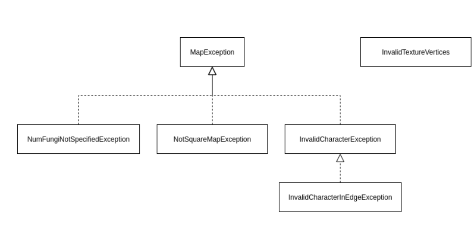

## Descrição das classes de exceção

| Classe                          | Descrição                                                                                                 |
|---------------------------------|-----------------------------------------------------------------------------------------------------------|
| MapException                    | Engloba todas as exceções de criação de mapa                                                              |
| NumFungiNotSpecifiedException   | Número máximo de fungos não foi especificado no arquivo .map ou é inválido                                |
| NotSquareMapException           | O mapa não é quadrado                                                                                     |
| InvalidCharacterException       | Caractere do mapa é inválido                                                                              |
| InvalidCharacterInEdgeException | Caractere na borda do mapa é inválido, todos os caracteres da borda do mapa devem ser paredes ou fungos   |
| InvalidTextureVertices          | Número de vértices fornecidos para Textured2DMesh é inválido para formação da imagem no formato requerido |

# Agradecimentos
* Ana Luisa Holthausen de Carvalho (arte do jogo)

